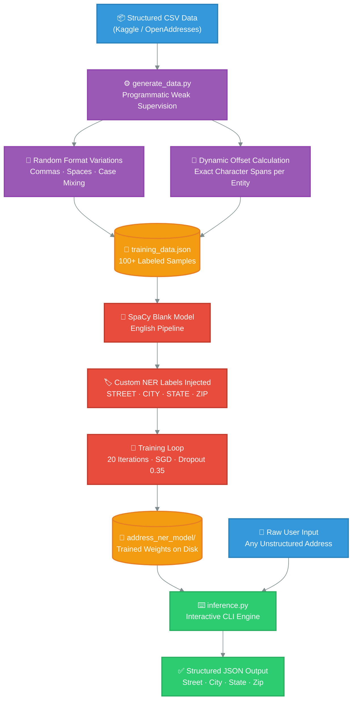

<p align="center">
  <h1 align="center">🏠 Iota Address Parser</h1>
  <p align="center"><i>An intelligent NER-powered engine that transforms messy, unstructured address strings into clean, structured JSON — built with SpaCy and Programmatic Weak Supervision.</i></p>
</p>

<p align="center">
  
  
  
  
</p>

---

## 🎯 What Does This Do?

> **Input:** `"456 Elm Street Los Angeles CA 90001"`
>
> **Output:**
> ```json
> {
>   "Street": "456 Elm Street",
>   "City": "Los Angeles",
>   "State": "CA",
>   "Zip": "90001"
> }
> ```

This project takes **raw, unstructured address text** — with inconsistent formatting, missing commas, mixed casing — and uses a **custom-trained Named Entity Recognition (NER) model** to intelligently extract and classify each component into a structured dictionary.

---

## 🧬 How It Works — The Full Pipeline

The system is composed of **three independent stages**, each with a single responsibility. This modular design ensures that any stage can be swapped, scaled, or improved without breaking the others.



### Stage Breakdown

| Stage | Script | What It Does | Key Technique |
|:------|:-------|:-------------|:--------------|
| **1. Data Generation** | `generate_data.py` | Takes structured address rows and reverse-engineers them into messy, unstructured strings with exact NER labels | Programmatic Weak Supervision — eliminates manual labeling |
| **2. Model Training** | `train_model.py` | Initializes a blank SpaCy neural network, injects custom entity labels, and trains using randomized mini-batches | Stochastic Gradient Descent with 35% Dropout to prevent overfitting |
| **3. Inference** | `inference.py` | Loads the saved model weights and provides an interactive CLI where any address can be typed and parsed in real-time | Model deserialization and token-level entity extraction |

---

## ⚡ Quick Start

### Prerequisites
- Python 3.10 or higher installed
- `pip` package manager

### 1. Clone & Setup
```bash
git clone https://github.com/SHAILESH-RS-UPADHYAY/iota-address-parser.git
cd iota-address-parser

# Create isolated virtual environment
python -m venv .venv

# Activate it
# Windows:
.\.venv\Scripts\Activate.ps1
# Mac/Linux:
source .venv/bin/activate

# Install dependencies
pip install -r requirements.txt
```

### 2. Run the Interactive Parser
The trained model weights are already included. You can start parsing immediately:
```bash
python inference.py
```
```
========================================
 IOTA ANALYTICS - ADDRESS PARSER ENGINE
========================================
Type 'exit' or 'quit' to close the program.

Enter an address to parse -> 789 pine ave seattle wa 98101

Processing...

[Parsed Output]:
{
  "Street": "789 pine ave",
  "City": "seattle",
  "State": "wa",
  "Zip": "98101"
}
```

### 3. Re-Train from Scratch (Optional)
```bash
python generate_data.py    # Generates 100 labeled samples
python train_model.py      # Trains NER model (20 epochs)
```

---

## 📊 Training Results

The model converges rapidly, dropping from a loss of **594.46** to near-zero within 20 iterations:

| Iteration | Loss | Status |
|:---------:|-----:|:------:|
| 1 | 594.46 | 🔴 Learning |
| 5 | 1.90 | 🟡 Converging |
| 10 | 0.0008 | 🟢 Stable |
| 20 | 0.00003 | ✅ Optimized |

---

## 🏗️ Scaling to Production

This prototype validates the core logic. For enterprise-scale deployment at production volume, the architecture would evolve across three dimensions:

### Data Layer
Replace the local Python script with **Apache Spark** or **Dask** pipelines processing millions of rows from the **OpenAddresses** global dataset, streaming labeled pairs into an **AWS S3** data lake.

### Model Layer
Swap SpaCy's CNN-based NER for a **HuggingFace Transformer** (e.g., fine-tuned `RoBERTa-base` for token classification). Transformers capture long-range contextual dependencies in deeply unstructured text far more effectively.

### Serving Layer
Wrap the production model in a **FastAPI** microservice, containerize with **Docker**, and deploy on **Kubernetes** or **AWS SageMaker** behind a load balancer — capable of parsing thousands of addresses per second with automated health checks and horizontal scaling.

---

## 🗂️ Project Structure

```
iota-address-parser/
├── generate_data.py        # Synthetic data generation pipeline
├── train_model.py          # SpaCy NER training loop
├── inference.py            # Interactive parsing CLI
├── training_data.json      # Generated training samples
├── requirements.txt        # Python dependencies
├── address_ner_model/      # Saved model weights (ready to use)
│   ├── config.cfg
│   ├── meta.json
│   ├── ner/
│   ├── tokenizer
│   └── vocab/
└── README.md
```

---

<p align="center"><i>Built as a prototype for <b>Iota Analytics, Mohali</b> — demonstrating end-to-end ML engineering from data generation to model deployment.</i></p>
