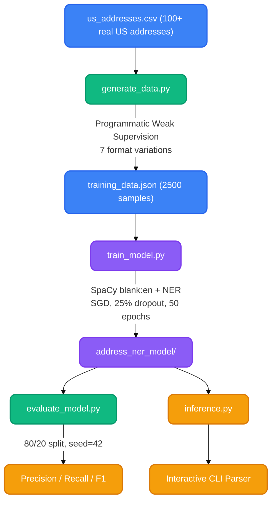

[](https://python.org)
[](https://spacy.io/)
[](https://github.com/SHAILESH-RS-UPADHYAY/iota-address-parser)

# 🏠 Iota Address Parser

An intelligent NER-powered engine that transforms messy, unstructured address strings into clean, structured JSON — built with SpaCy and Programmatic Weak Supervision.

Built as a prototype for **Iota Analytics, Mohali** — demonstrating end-to-end ML engineering from data generation to model deployment.

---

## How It Works

**End-to-end pipeline:**
> `Raw CSV Addresses` ➜ `Synthetic Data Generator (7 format variations)` ➜ `SpaCy NER Training (SGD + Dropout)` ➜ `Evaluation (P/R/F1)` ➜ `Interactive Inference CLI`

```
Input:  "456 oak avenue, portland, oregon 97201"
Output: { "Street": "456 oak avenue", "City": "portland", "State": "oregon", "Zip": "97201" }
```

The model extracts **4 entity types** from free-text addresses:

| Entity | Description | Example |
|--------|-------------|---------|
| `STREET` | Street number + name | "123 Main St" |
| `CITY` | City name | "San Francisco" |
| `STATE` | US state name | "California" |
| `ZIP` | Postal code | "94102" |

---

## Architecture



---

## Why These Technical Choices

- **SpaCy over Transformers/BERT** — For structured entity extraction from short text, SpaCy's statistical NER is faster, lighter, and produces comparable accuracy. BERT would be overkill for 4-entity extraction from single-line inputs.

- **Programmatic Weak Supervision over manual labeling** — Instead of hand-labeling 2500 addresses, I wrote labeling functions that reverse-engineer structured CSV rows into messy strings while tracking exact character offsets. This generates perfectly labeled data at scale with zero human annotation cost.

- **7 format variations for robustness** — Real-world addresses come in wildly inconsistent formats. The generator creates:
  - `Street, City, State Zip` (standard)
  - `street city state zip` (no commas, lowercase)
  - `Street City,State Zip` (missing spaces)
  - And 4 more variations — forcing the model to learn patterns, not punctuation.

- **Compounding batch sizes (8→64)** — Starts with small batches for precise early learning, then scales up for stable convergence. This is a well-known SpaCy training optimization.

- **25% dropout regularization** — Prevents overfitting on a synthetically generated dataset where patterns could be too clean.

---

## Project Structure

```
iota-address-parser/
├── generate_data.py        # Synthetic data generator (Programmatic Weak Supervision)
├── train_model.py          # SpaCy NER training loop (SGD, dropout, compounding batches)
├── evaluate_model.py       # Precision/Recall/F1 scoring with train/test split
├── inference.py            # Interactive CLI for live address parsing
├── us_addresses.csv        # Seed data: 100+ real US addresses
├── training_data.json      # Generated: 2500 labeled training samples
├── address_ner_model/      # Trained SpaCy model artifact
│   ├── meta.json
│   ├── config.cfg
│   └── ner/                # Serialized NER weights
└── requirements.txt
```

## Run It Locally

```bash
# 1. Clone
git clone https://github.com/SHAILESH-RS-UPADHYAY/iota-address-parser.git
cd iota-address-parser

# 2. Install
pip install -r requirements.txt

# 3. Generate training data (2500 samples from 100+ real addresses)
python generate_data.py

# 4. Train the model (50 epochs, ~2 min on CPU)
python train_model.py

# 5. Evaluate (prints Precision, Recall, F1 per entity)
python evaluate_model.py

# 6. Try it live
python inference.py
# → Enter: "456 oak avenue, portland, oregon 97201"
# → Output: {"Street": "456 oak avenue", "City": "portland", "State": "oregon", "Zip": "97201"}
```

## Known Limitations & What I'd Improve

- **US-only addresses** — Currently trained on US address formats. Supporting international formats (India, UK) would require additional labeling functions and entity types (e.g., `DISTRICT`, `PIN_CODE`).
- **No apartment/unit handling** — Addresses like "123 Main St, Apt 4B" aren't split into separate street and unit entities. This would require adding a `UNIT` label and updating the generator.
- **Evaluation on synthetic data** — The test set is generated by the same process as training data. A production evaluation would need a hand-labeled holdout set of real messy addresses.
- **No API wrapper** — Currently CLI-only. In production, this would be wrapped in a FastAPI endpoint for batch processing.

---

*Built for Iota Analytics — demonstrating end-to-end ML engineering from data generation to deployment.*
