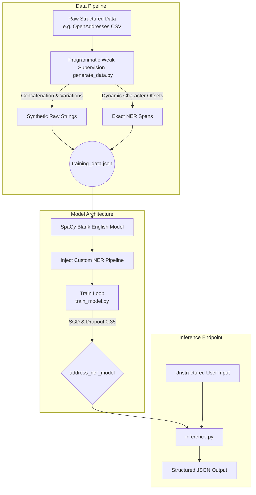

# 🚀 Iota Address Parser (NER Prototype)

An end-to-end Machine Learning pipeline designed to extract, classify, and structure raw address strings into precise JSON objects (Street, City, State, Zip) using Custom Named Entity Recognition (NER).

This prototype was built as a demonstration of **Programmatic Weak Supervision** and **NLP model architecture** for extracting structured intelligence from unstructured spatial data.

---

## 🧠 System Architecture & Workflow

The pipeline consists of three core components: Data Generation, Model Training, and Inference. 



---

## 🛠️ How to Run the Prototype

To test the model, you do not need to train it. The pre-trained weights are included in the `address_ner_model` directory for instant inference.

### 1. Setup Environment
```bash
# Clone the repository
git clone https://github.com/SHAILESH-RS-UPADHYAY/iota-address-parser.git
cd iota-address-parser

# Create and activate a virtual environment (Recommended)
python -m venv .venv
# On Windows: .\.venv\Scripts\Activate.ps1
# On Mac/Linux: source .venv/bin/activate

# Install dependencies
pip install -r requirements.txt
```

### 2. Interactive Testing (Inference)
Launch the interactive CLI to type any unstructured address and watch the model extract the entities.
```bash
python inference.py
```
**Example Output:**
```json
Enter an address to parse -> 123 Main St, New York, NY 10001
[Parsed Output]:
{
  "Street": "123 Main St",
  "City": "New York",
  "State": "NY",
  "Zip": "10001"
}
```

### 3. Re-Training the Model (Optional)
If you want to view the data pipeline and loss optimization in real-time:
```bash
# 1. Re-generate synthetic training data
python generate_data.py

# 2. Train the neural network
python train_model.py
```

---

## 📈 Scaling for Enterprise & Vast Data

While **SpaCy** is an incredible tool for CPU-bound rapid prototyping and validating logic, enterprise-scale address parsing (such as processing hundreds of millions of global addresses) requires scaling both the pipeline and the architecture.

If deployed at scale, the following production architecture would be implemented:

### 1. Big Data Pipeline
Instead of running a single local Python script, the programmatic generation pipeline (`generate_data.py`) would be translated into **Apache Spark** or **Dask**. This allows for parallelized processing of massive datasets like global OpenAddresses, streaming the generated JSONL training pairs directly into an AWS S3 Data Lake.

### 2. Transformer-Based Architecture
For significantly messier, out-of-domain data, I would transition the model from SpaCy's CNN to a **HuggingFace Transformer** architecture. Fine-tuning a model like `RoBERTa-base` for token classification provides superior contextual awareness for deeply unstructured text. 

### 3. High-Throughput Deployment
The final model weights would be wrapped in a **FastAPI** application, containerized via Docker, and deployed to a Kubernetes cluster or AWS SageMaker. Sitting behind a load balancer, this microservice could parse thousands of unstructured addresses per second, serving downstream applications reliably.
